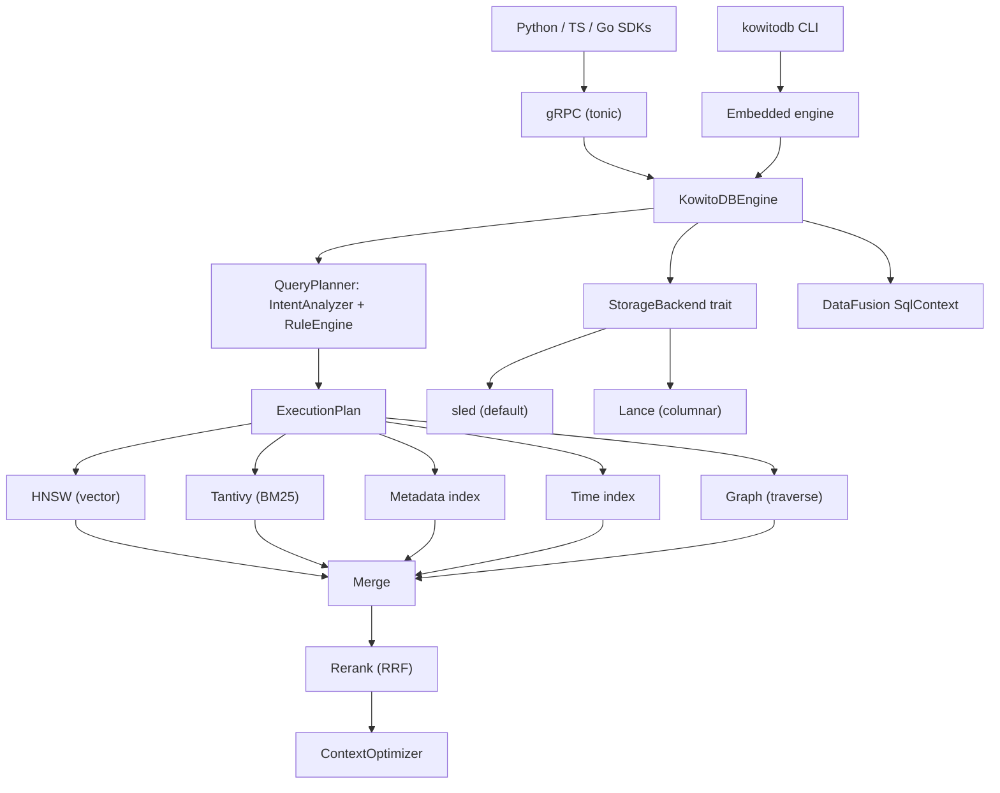

# KowitoDB — The Database Built for AI Agents

**One database. One API call. No stitching required.**

KowitoDB is the first open-source database purpose-built for the AI era — not a
vector database, but a **knowledge operating system**. It unifies vector search,
full-text BM25, a knowledge graph, metadata indexing, time-range queries, agent
memory, and SQL into a single Rust engine behind one gRPC call: `ai.ask()`.

---

### The problem with every other RAG stack

Building retrieval-augmented generation today means assembling a fragile chain of
separate systems:

```python
# Conventional RAG — 6+ systems, hundreds of lines of glue code:
embedding = model.embed(query)
vectors = qdrant.search(embedding, top_k=50)
docs = postgres.query("SELECT * FROM docs WHERE ...")
graph_results = neo4j.run("MATCH (d:Doc)-[r]->(e) ...")
merged = reciprocal_rank_fusion(vectors, docs, graph_results)
reranked = cross_encoder.rerank(query, merged)
context = trim_to_token_budget(reranked, 4096)
answer = llm.generate(query, context)
```

**With KowitoDB — one call:**

```python
answer = db.ask("Which enterprise customers renewed after Series A?")
```

KowitoDB detects the query's **intent**, builds an **execution plan** across
six indexes, traverses the **knowledge graph**, **reranks** with Reciprocal Rank
Fusion and an optional cross-encoder, and assembles a token-budgeted context —
behind a single function call. No glue code. No separate services. No drift
between indexes.

---

## Why KowitoDB over [Qdrant / Pinecone / Weaviate / Milvus]?

Vector databases are excellent at one thing: vector search. But real-world AI
applications need more.

| Your app needs | Vector DB alone | KowitoDB |
|---|---|---|
| Semantic search | ✅ | ✅ |
| Full-text keyword (BM25) | ❌ *bolt on Elasticsearch* | ✅ Built in (Tantivy) |
| Knowledge graph traversal | ❌ *bolt on Neo4j* | ✅ Built in |
| Hybrid retrieval (vector + keyword + graph) | ❌ *you write the fusion* | ✅ Automatic RRF |
| Agent memory & conversation sessions | ❌ *bolt on Redis/Postgres* | ✅ Built in |
| SQL analytics | ❌ *separate data warehouse* | ✅ Built in (DataFusion) |
| Intent-aware query routing | ❌ *you classify manually* | ✅ Automatic |
| Cross-encoder reranking | ❌ *separate service* | ✅ Built in (Candle) |
| ColBERT late-interaction scoring | ❌ | ✅ Built in (v0.29) |
| Context assembly & dedup | ❌ *you write it* | ✅ Built in |
| Single binary deployment | ❌ *orchestrate 4+ services* | ✅ `cargo build --release` |

**KowitoDB doesn't replace a vector DB — it replaces the vector DB, the
full-text engine, the graph store, the agent-memory cache, the reranker, and the
query orchestrator, in one Rust binary.**

---

## Benchmark honesty

We benchmark against Qdrant and Milvus on identical data at matched HNSW
parameters. Here's the truth:

### Recall@10 on clustered data (real-embedding-like)

| ef | KowitoDB | KowitoDB-std | Qdrant | Milvus |
|----|---------:|-------------:|-------:|-------:|
| 16 | 0.915 | 0.957 | **0.976** | 0.908 |
| 32 | 0.994 | 0.994 | **0.997** | 0.986 |
| 64 | 0.9997 | 0.9996 | 0.9998 | 0.999 |
| 128 | 0.9999 | 0.9999 | **1.000** | 0.9999 |

**On real-embedding-like data: everyone converges by ef≈32 (~0.99+).** KowitoDB
is competitive with Qdrant and ahead of Milvus's default config. Qdrant leads
slightly at low ef — a gap of implementation maturity, not architecture. We ship
a standard-HNSW mode that closes most of it (`0.915 → 0.957` at ef=16).

### Speed: embedded vs. networked

KowitoDB runs **embedded** (in-process, no network) at ~6–40K queries/sec.
Qdrant and Milvus run as localhost services at ~0.4–1.4K q/s — dominated by
HTTP/gRPC round-trip latency, not raw search speed. When you run KowitoDB behind
its own gRPC server, the numbers converge. *This is a deployment-mode difference,
not a speed difference.*

Full reproducible benchmark: [`benchmarks/comparison/README.md`](benchmarks/comparison/README.md).

---

## What's inside

### Six integrated indexes

| Index | Engine | What it answers |
|---|---|---|
| **Vector** | Custom HNSW (1,600+ lines Rust) | "What's semantically similar to this?" |
| **Full-text** | Tantivy BM25 | "What contains these exact words?" |
| **Graph** | Bidirectional edge store | "What's connected to what?" |
| **Metadata** | In-memory exact/substring | "What matches this key=value?" |
| **Time** | Sorted index | "What was created between X and Y?" |
| **Multi-vector** | ColBERT MaxSim (v0.29) | "Which tokens match which tokens?" |

### The retrieval pipeline

```
ai.ask("Which enterprise customers renewed after Series A?")
        │
        ▼
┌──────────────────────┐
│  Intent Analyzer     │  → detects "temporal + entity" intent
└──────┬───────────────┘
       │
       ▼
┌──────────────────────┐
│  Execution Planner   │  → vector search + keyword search + time filter + graph walk
└──────┬───────────────┘
       │
       ▼
┌──────────────────────────────────────────────┐
│  HNSW ──┬── Tantivy ──┬── Time ──┬── Graph   │  parallel retrieval
└─────────┼─────────────┼──────────┼───────────┘
          │             │          │
          └─────────────┼──────────┘
                        │
                        ▼
              ┌──────────────────┐
              │  RRF Reranker    │  → weighted fusion + cross-source boosting
              └────────┬─────────┘
                       │
                       ▼
              ┌──────────────────┐
              │  Cross-Encoder   │  → (optional) learned second-stage rerank
              └────────┬─────────┘
                       │
                       ▼
              ┌──────────────────┐
              │ Context Optimizer│  → Jaccard dedup + token-budgeted assembly
              └────────┬─────────┘
                       │
                       ▼
                  [results]
```

### Research-grounded features

Every advanced capability is backed by published research:

| Feature | Paper / Source | What it does |
|---|---|---|
| **Contextual Retrieval** | Anthropic 2024 | Embeds metadata-augmented text → 49% fewer retrieval failures |
| **CRAG Corrective Gate** | arxiv 2401.15884 | Auto-broadens search when confidence is low |
| **RaBitQ Quantization** | SIGMOD 2024 | 1-bit vectors at ~32× less memory with asymptotically unbiased estimator |
| **Matryoshka Embeddings** | arxiv 2205.13147 | Adaptive-dimension retrieval (fast coarse pass → full-dim refinement) |
| **LazyGraphRAG** | Microsoft 2024 | Auto-graph from cheap entity extraction (0.1% of full GraphRAG cost) |
| **GraphRAG Summarization** | Microsoft 2024 | Community detection + LLM summarization for global queries |
| **ColBERT MaxSim** | arxiv 2112.01488 | Token-level late-interaction scoring for highest-quality retrieval |
| **Mem0 Memory** | Mem0 2024 | Searchable agent memory with LLM distillation |

### Agent memory that learns

```python
# Conversations become searchable knowledge automatically
session_id = db.record_turn(
    session_id="session-123",
    role="user",
    content="The Acme deal closed at $2.4M ARR."
)
# Later: that fact is retrievable via ai.ask() alongside your documents
db.ask("What's the status of the Acme deal?")
```

Turns are promoted to searchable knowledge objects, linked to existing knowledge
via graph edges, and distilled by an LLM into clean durable facts. Your agent
remembers — not in a separate cache, but in the same database that stores your
documents.

### SQL: analytics on your knowledge

```sql
SELECT COUNT(*) FROM knowledge WHERE importance > 0.8;
SELECT content, created_at FROM knowledge
  WHERE metadata.stage = 'series_a'
  ORDER BY importance DESC LIMIT 10;
```

Powered by Apache DataFusion — real aggregates, GROUP BY, projections. No
separate analytics database required.

### Distribution that ships

A `gateway` coordinator partitions writes across N data nodes (with configurable
replication and write quorum), scatter-gathers reads, and merges results — all
behind the same gRPC API. Tunable durability, failure-tolerant reads, health
tracking, and rebalancing on membership changes. Eventually consistent by design
(the right choice for a knowledge store), with last-write-wins reconciliation
and read-repair.

---

## Quick Start

### 1. Build (one command)

```bash
git clone https://github.com/kowito/kowitodb && cd kowitodb
cargo build --release
```

> Prerequisite: `protoc` (Protocol Buffers compiler) — `brew install protobuf`
> or `apt-get install -y protobuf-compiler`.

### 2. Run the server

```bash
./target/release/kowitodb serve \
  --addr 127.0.0.1:50051 \
  --storage-path ./data/storage \
  --index-path ./data/index

# ...or in dev mode, no release build needed:
cargo run -p kowitodb -- serve

# ...or skip the server entirely (embedded mode):
cargo run -p kowitodb -- ask "what do you know?"
```

That's it. One binary. No Docker, no sidecars, no external services. Set
`--api-key` (or `KOWITODB_API_KEY`) to require authentication on every request.

### 3. Use it

```python
from kowitodb import KowitoDBClient

db = KowitoDBClient("localhost:50051")

# Store knowledge
db.remember(
    "Acme Corp renewed their enterprise license in March 2024 "
    "after Series A funding of $15M.",
    keywords=["acme", "renewal", "series a", "enterprise"],
    metadata={"company": "Acme Corp", "stage": "series_a"},
    importance=0.9,
)

# Ask — one call, all indexes
resp = db.ask("Which enterprise customers renewed after Series A?")
print(f"Intent: {resp.detected_intent}")  # "temporal_entity"
for r in resp.results:
    print(f"[{r.relevance_score:.2f}] ({r.retrieval_source}) {r.content}")
```

### 4. Scale out (when you need it)

```bash
# Data nodes
kowitodb serve --addr 0.0.0.0:50051 --storage-path /data/n1 --index-path /data/n1_idx
kowitodb serve --addr 0.0.0.0:50052 --storage-path /data/n2 --index-path /data/n2_idx

# Gateway coordinator (same API)
kowitodb gateway --addr 0.0.0.0:50050 \
  --peers host1:50051,host2:50052 \
  --replication-factor 2 \
  --write-quorum 2
```

Clients point at the gateway — same SDK, same API, no code changes.

---

## Embedding models

KowitoDB works with any embedding model. Three clients ship in the box:

| Provider | Setup | Best for |
|---|---|---|
| **On-device Candle** | `--features local-embeddings` + `KOWITODB_EMBEDDING_PROVIDER=local` | Zero-latency, air-gapped |
| **OpenAI / compatible** | `KOWITODB_EMBEDDING_PROVIDER=openai` + `OPENAI_API_KEY` (opt. `KOWITODB_OPENAI_BASE_URL`, `KOWITODB_EMBEDDING_MODEL`) | Production quality |
| **Ollama** | `KOWITODB_EMBEDDING_PROVIDER=ollama` (opt. `KOWITODB_OLLAMA_URL`) | Local, self-hosted |
| **Dev proxy** (default) | None | Deterministic hashes for testing |

No embedding provider? No problem — the dev proxy gives you deterministic vectors
for development. Switch to a real model in production with one env var.

---

## Configuration

KowitoDB is configured with `KOWITODB_*` environment variables (CLI flags take
precedence where both exist). The most common:

| Variable | Default | Purpose |
|---|---|---|
| `KOWITODB_API_KEY` | _(none)_ | Require this key (Bearer / `x-api-key`) on every request |
| `KOWITODB_TLS_CERT` / `KOWITODB_TLS_KEY` | _(none)_ | Enable TLS with a PEM cert/key |
| `KOWITODB_EMBEDDING_PROVIDER` | dev proxy | `local` \| `openai` \| `ollama` |
| `KOWITODB_LLM_PROVIDER` | _(off)_ | `openai` \| `ollama` — enables NL→SQL, contextual retrieval, Mem0 distillation |
| `KOWITODB_VECTOR_QUANTIZE` | `0` | int8 quantization (~4× less vector memory) |
| `KOWITODB_VECTOR_BINARY_QUANTIZE` | `0` | RaBitQ 1-bit quantization (~32× less memory) |
| `KOWITODB_VECTOR_BINARY_RERANK` | `0` | Retain int8 to rescore binary candidates (higher recall) |
| `KOWITODB_VECTOR_COARSE_DIM` | _(off)_ | Matryoshka adaptive-dimension retrieval |
| `KOWITODB_RERANKER_PROVIDER` | _(off)_ | `local` → on-device cross-encoder reranker |
| `KOWITODB_AUTO_GRAPH` | `1` | Auto-build `co_mentions` graph edges at ingest |
| `KOWITODB_CONTEXTUAL_RETRIEVAL` | `1` | Contextual Retrieval augmentation |
| `KOWITODB_CORRECTIVE_RETRIEVAL` | `1` | CRAG-style corrective gate |

---

## Performance at a glance

Micro-benchmarks on a developer laptop (single-threaded, release build). Run them
on your hardware: `cargo run --release -p kowitodb-index --example bench_hnsw`.

| Metric | Value |
|---|---|
| **Recall@10** (default ef=200) | ~94% |
| **Single-thread QPS** | ~660 q/s |
| **Concurrent QPS** (10-core) | ~3,700 q/s (5.7×) |
| **Build throughput** (serial) | ~1,150 inserts/s |
| **Build throughput** (sharded, 10-core) | ~25,000 inserts/s (21×) |
| **Memory (int8 quantized)** | ~4× less than f32 |
| **Memory (binary quantized)** | ~32× less than f32 |

Full benchmarks, quantization comparisons, and recall/latency trade-offs:
[`docs/BENCHMARKS.md`](docs/BENCHMARKS.md).

---

## SDKs

| Language | Package | Transport |
|---|---|---|
| **Python** | `kowitodb` (`sdk/python`) | `grpcio` |
| **TypeScript** | `@kowitodb/sdk` (`sdk/typescript`) | `@grpc/grpc-js` |
| **Go** | `github.com/kowito/kowitodb/sdk/go` | `google.golang.org/grpc` |

All three expose the same surface: `remember`, `ask`, `forget`, `insert`, `get`,
`update`, `search`, `sql`, `record_turn`, `get_session`, and `stats`.

---

## Architecture



See [`docs/ARCHITECTURE.md`](docs/ARCHITECTURE.md) for a crate-by-crate breakdown
and the full retrieval pipeline.

---

## gRPC API

The complete service definition is in [`proto/kowitodb.proto`](proto/kowitodb.proto).

| RPC | What it does |
|---|---|
| `Insert` / `BatchInsert` | Store knowledge objects (content, embeddings, metadata, keywords, relationships) |
| `Get` / `Update` / `Delete` | CRUD by UUID, with version history on update |
| `List` | Paginated enumeration with total count |
| `Search` | Direct multi-index search with optional metadata filter |
| `Ask` | **The main event.** Intent detection → planned retrieval → reranked results |
| `Remember` | High-level ingest with auto-embedding |
| `Sql` | Full DataFusion SQL over the `knowledge` table |
| `RecordTurn` / `GetSession` | Agent conversation memory |
| `Stats` | Object counts, index sizes, graph metrics, cost tracking, cache hit rate |

Health-checking, gRPC reflection, and Prometheus metrics are always on.

---

## Honest limits

Every product has them. Ours are documented, not hidden:

- **In-memory indexes.** The working set must fit in RAM. Binary quantization
  pushes the ceiling to ~32× more vectors, but billion-scale needs the on-disk
  DiskANN graph — deferred as a dedicated future subsystem
  ([details](docs/ROADMAP.md#deliberately-not-pursuing)).
- **Eventually consistent, not linearizable.** The distributed gateway uses
  last-write-wins + read-repair — correct for a knowledge store, not a bank ledger.
  No Raft consensus (deliberate; it's a separate product).
- **Auth + TLS off by default.** Available, opt-in. Restrict network access at
  the infrastructure layer regardless.
- **Pre-1.0.** Production-worthy but still evolving. Read
  [`docs/DEPLOYMENT.md`](docs/DEPLOYMENT.md) and
  [`docs/OPERATIONS.md`](docs/OPERATIONS.md) before deploying.

---

## When to use KowitoDB

| ✅ Use KowitoDB when... | ❌ Use something else when... |
|---|---|
| You're building an AI agent or RAG app | You only need pure vector search at billion-scale |
| You want one database, not six | You already have a mature multi-service stack |
| You need graph + vector + keyword in one query | You need strict serializable transactions |
| You want embedded deployment (library, no network) | You need a managed cloud service today |
| You value honest, research-grounded engineering | You need every last point of HNSW recall on uniform random data |

---

## Documentation

| Doc | Covers |
|---|---|
| [`ARCHITECTURE.md`](docs/ARCHITECTURE.md) | Crates, retrieval pipeline, all six indexes, storage abstraction, DataFusion SQL |
| [`DEPLOYMENT.md`](docs/DEPLOYMENT.md) | Release builds, configuration, Docker, sizing, persistence, observability |
| [`OPERATIONS.md`](docs/OPERATIONS.md) | Backup/restore, upgrades, metrics, plan cache, scaling |
| [`SDKS.md`](docs/SDKS.md) | Python / TypeScript / Go SDK usage and codegen |
| [`BENCHMARKS.md`](docs/BENCHMARKS.md) | HNSW recall/latency benchmarks, quantization, how to reproduce |
| [`ROADMAP.md`](docs/ROADMAP.md) | Shipped, in-progress, and explicitly deferred features with research citations |
| [`benchmarks/comparison/`](benchmarks/comparison/) | Reproducible Qdrant/Milvus/KowitoDB ANN comparison |

---

## Contributing

Contributions welcome. See [`CONTRIBUTING.md`](CONTRIBUTING.md) for the build +
test cheatsheet (it's the exact set of commands CI runs). The short version:

```bash
cargo fmt --all --check && \
cargo clippy --workspace --all-targets -- -D warnings && \
cargo test --workspace
```

---

## License

[MIT](LICENSE). Open source, forever.
